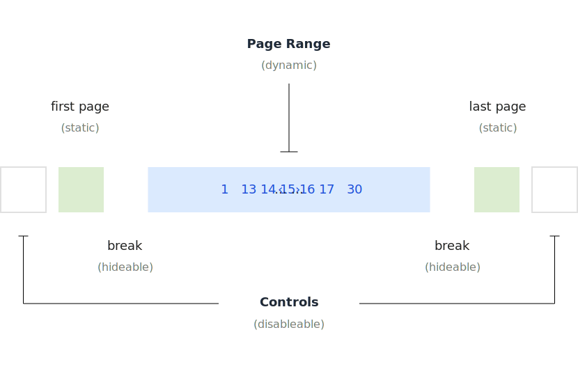

# vue-paginator
A responsive paginator for Vue 3 based on [vue-router](https://router.vuejs.org/) and [tailwind](https://tailwindcss.com/). See demo at [stackblitz](https://stackblitz.com/edit/vue-paginator?file=src%2Fviews%2FHome.vue).

<picture>
  <source media="(prefers-color-scheme: dark)" srcset=".github/paginator-struct-dark.svg">
  <source media="(prefers-color-scheme: light)" srcset=".github/paginator-struct-light.svg">
  
</picture>

<br>

<picture>
  <source media="(prefers-color-scheme: dark)" srcset=".github/paginator-v1-dark.svg">
  <source media="(prefers-color-scheme: light)" srcset=".github/paginator-v1-light.svg">
  
</picture>

<br>

<picture>
  <source media="(prefers-color-scheme: dark)" srcset=".github/paginator-v2-dark.svg">
  <source media="(prefers-color-scheme: light)" srcset=".github/paginator-v2-light.svg">
  
</picture>

<br>
<br>

### Usage

```js
var pagination = ref({
  offset: 0,
  limit: 15,
});

var items = ref(
  Array.from({ length: 300 })
);

var paginationItems = computed(() => {
  return items.value.slice(
    pagination.value.offset,
    pagination.value.offset + pagination.value.limit);
});

var selectPage = ({ offset }) => (
  pagination.value.offset = offset;
);
```

```html
<!-- Iteration -->

<tr v-for="item of paginationItems" :key="item">
  <td>Name {{ item }}</td>
  <td>Age {{ item }}</td>
  <td>Address {{ item }}</td>
</tr>
```

#### Without Controls, and 5 range elements

```html
<Paginator @select="selectPage"
    :page-range="5"
    :limit="pagination.limit"
    :total-items="items.length" />
```

#### With Controls, and 3 range elements

```html
<PaginatorControls @select="selectPage"
    :limit="pagination.limit"
    :total-items="items.length" />
```

### Responsive Paginator

It will render **page range** items depending on the window size.

```html
<PaginatorResponsive @select="selectPage"
  :limit="pagination.limit"
  :total-items="items.length" />
```

### Run

```bash
npm install
npm run build
npm run dev
```
