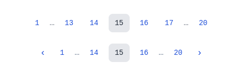

# vue-paginator
A paginator for VueJS based on vue-router



### Structure

<span style="color:green"> **&lt;** </span> <span style="color:greenyellow">(1)</span> <span style="color:gray">..</span> <span style="color:magenta"> 3 4 5</span> <span style="color:gray">..</span> <span style="color:greenyellow">(N)</span> <span style="color:green"> **&gt;** </span>

- <span style="color:green">Controls</span> (prev | next)

- <span style="color:greenyellow">First</span> & <span style="color:greenyellow">Last</span> pages
- <span style="color:magenta">Page Range</span> (3 or more elements)


```js
var pagination = ref({
  offset: 0,
  limit: 15,
});

var selectPage = ({ offset }) => (
  pagination.value.offset = offset;
);
```

```html
<!-- Without Controls -->

<Paginator @select="selectPage"
    :page-range="5"
    :limit="pagination.limit"
    :total-items="items.length" />

<!-- With Controls -->

<PaginatorControls @select="selectPage"
    :page-range="3"
    :limit="pagination.limit"
    :total-items="items.length" />
```
